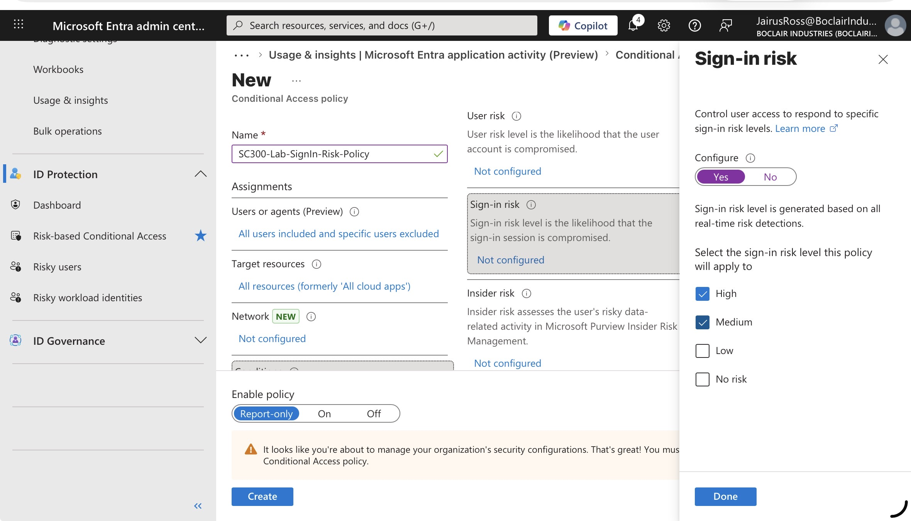
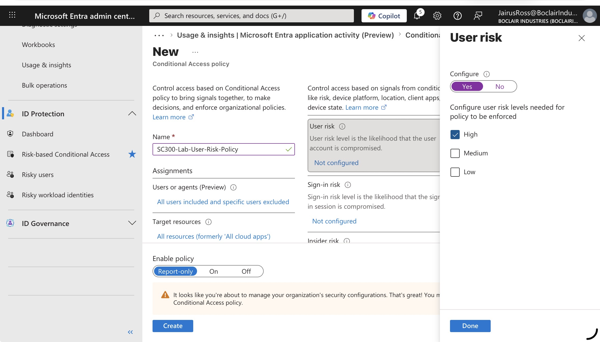

# Lab 13 — Identity Protection Risk Policies

Configured two risk-based Conditional Access policies in Microsoft Entra ID 
to detect and respond to compromised identities.

## Sign-in Risk Policy
- Condition: Sign-in risk — Medium + High
- Grant: Require MFA
- Users: All users (break-glass account excluded)
- Status: Report-only

## User Risk Policy
- Condition: User risk — High only
- Grant: Require password change + MFA strength
- Users: All users (break-glass account excluded)
- Status: Report-only

